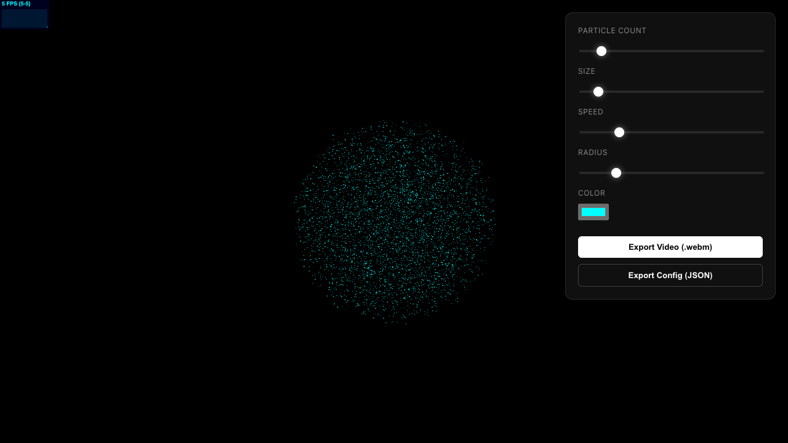
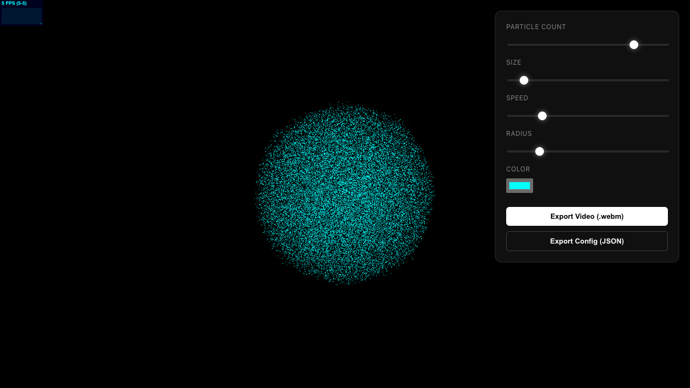
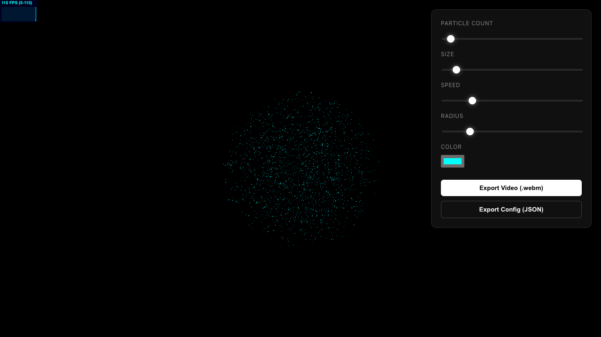
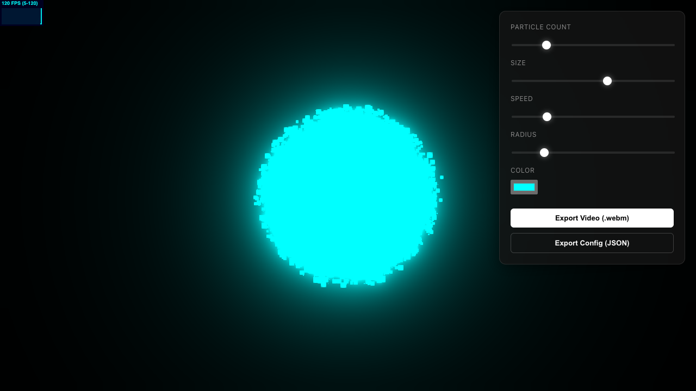
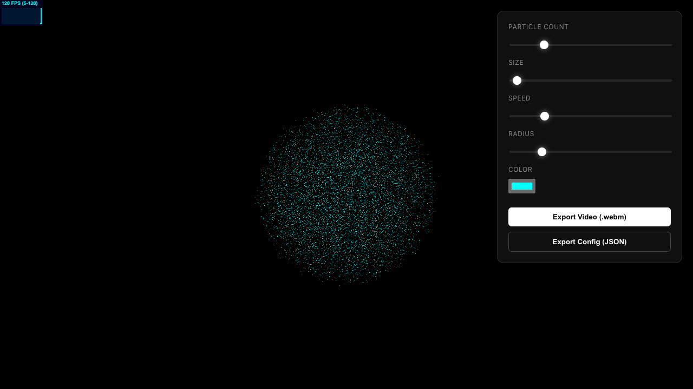
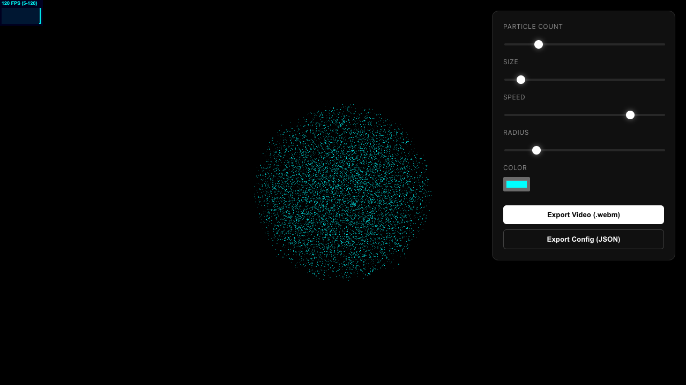
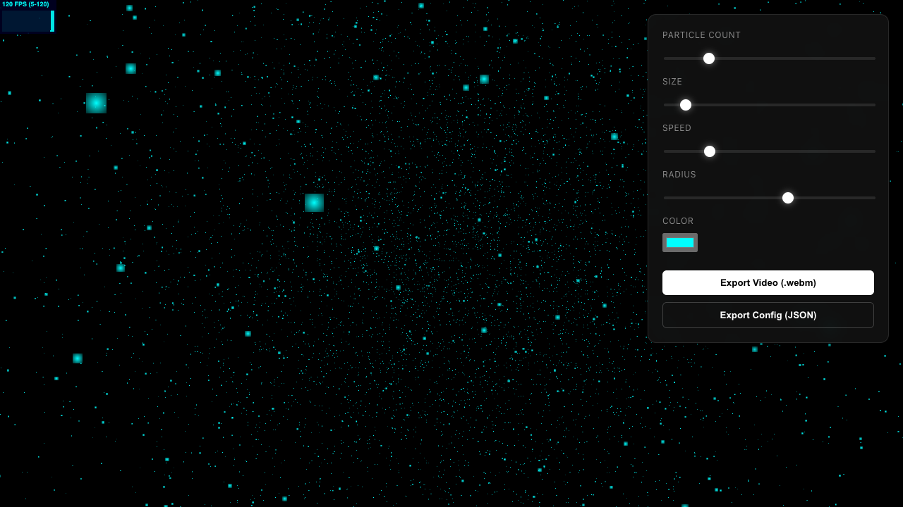
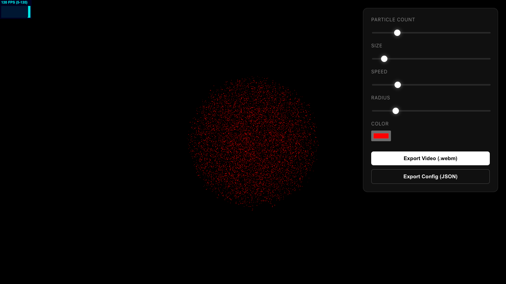
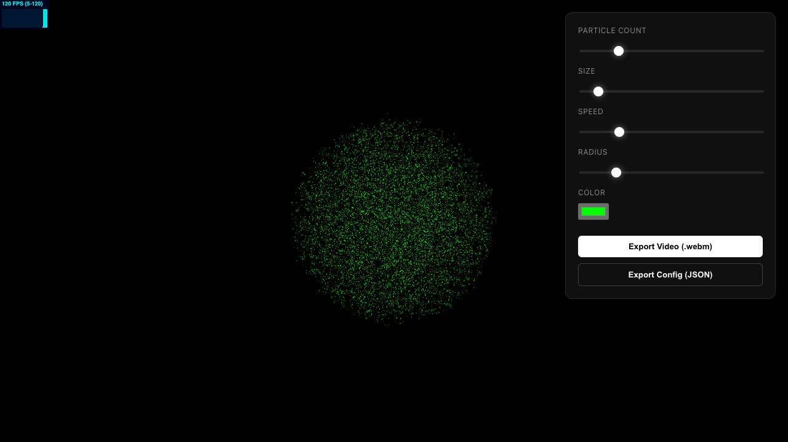

# Particle Generator

A high-performance, 60fps particle generator web application built with Three.js and Vite. Create stunning glowing particle scenes, customize them in real-time, and export as video or configuration.

## Features

- **Real-time Customization**: Adjust particle count, size, speed, radius, and color.
- **Glowing Particles**: Premium visual effects using UnrealBloomPass.
- **Video Export**: Record 5-second clips as `.webm` files.
- **Config Export**: Save and load particle configurations.
- **High Performance**: Optimized for 60fps even with high particle counts.

## Screenshots

| Default | High Count |
|---------|------------|
|  |  |

| Low Count | Large Size |
|-----------|------------|
|  |  |

| Small Size | High Speed |
|------------|------------|
|  |  |

| Large Radius | Red Color |
|--------------|-----------|
|  |  |

| Blue Color | Green Color |
|------------|-------------|
|  |  |

## Getting Started

### Prerequisites

- Node.js (v14 or higher)

### Installation

1. Clone the repository:
   ```bash
   git clone https://github.com/manikrathee/particle-generator.git
   ```
2. Install dependencies:
   ```bash
   npm install
   ```

### Running Locally

Start the development server:
```bash
npm run dev
```
Open your browser to `http://localhost:5173`.

## Usage

1. **Controls**: Use the UI overlay to change parameters.
2. **Export Video**: Click the button to download a `.webm` video.
3. **Export Config**: Save your settings as a JSON file.

## Technologies

- [Vite](https://vitejs.dev/)
- [Three.js](https://threejs.org/)
- [CCapture.js](https://github.com/spite/ccapture.js)
